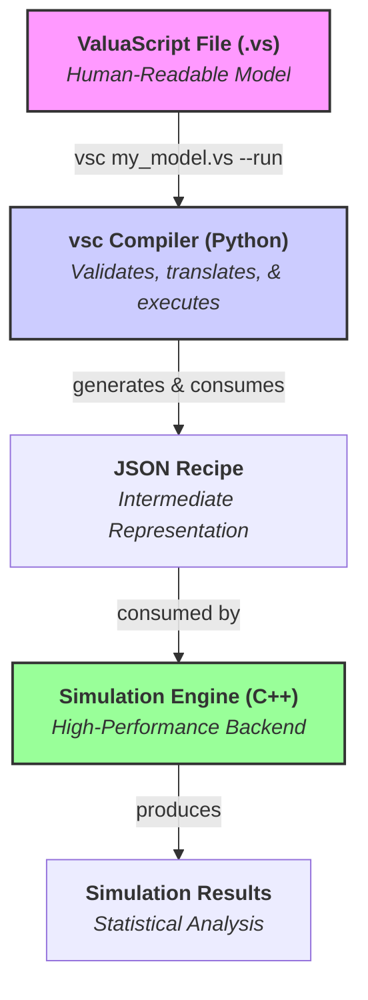

# ValuaScript & The Quantitative Simulation Engine

[](https://github.com/Alessio2704/monte-carlo-simulator/actions)
[](https://opensource.org/licenses/MIT)
[](https://isocpp.org/std/the-standard)
[](https://www.python.org/downloads/)

**A high-performance, multithreaded C++ engine for quantitative financial modeling, driven by ValuaScript—a simple, dedicated scripting language with a smart, validating compiler.**

## 📖 About The Project

This project was born from the need to bridge the gap between the intuitive but slow nature of spreadsheet-based financial modeling and the powerful but often verbose nature of general-purpose programming languages. The goal is to provide a platform that offers the **usability** of a dedicated modeling language with the **raw performance** of compiled, multithreaded C++.

It is designed to execute complex, multi-year, stochastic financial models, running hundreds of thousands of Monte Carlo simulations in seconds—a task that would take minutes or hours in traditional tools.

### Key Features

- **✨ Simple & Intuitive Language:** Models are defined in **ValuaScript (`.vs`)**, a clean, declarative language with a **familiar, spreadsheet-like formula syntax** using standard mathematical operators (`+`, `-`, `*`, `/`, `^`).
- **🚀 High-Performance Backend:** A core engine written in modern C++17, fully multithreaded to leverage all available CPU cores for maximum simulation speed.
- **🐍 Smart Validating Compiler:** A robust compiler, `vsc`, transpiles ValuaScript into a JSON recipe. It provides **clear, user-friendly error messages** and performs advanced **static type inference** to catch logical errors before execution.
- **⚙️ Streamlined Workflow:** A `--run` flag allows for a seamless, one-step compile-and-execute experience.
- **📊 Data Export:** Natively supports exporting full simulation trial data to CSV files for further analysis with the `@output_file` directive.
- **🎲 Integrated Monte Carlo Simulation:** Natively supports a rich library of statistical distributions (`Normal`, `Pert`, `Lognormal`, etc.) with fully validated parameters.
- **🛡️ Robust & Tested:** Comprehensive unit test suite for both the C++ engine (GoogleTest) and the Python compiler (Pytest), ensuring correctness and stability.

## 🏛️ Architecture

The platform is built on a clean, three-layer architecture that separates human-readable modeling from high-speed computation.



## 🚀 Getting Started

There are two paths for using this project: as an **End-User** (recommended for most) or as a **Developer** (if you want to contribute).

### For End-Users

1.  **Download the `vsc` Compiler:**
    Go to the [**latest GitHub Release**](https://github.com/Alessio2704/monte-carlo-simulator/releases) and download the `vsc` executable for your operating system. Place it in a convenient location.

2.  **Build the C++ Engine:**
    You only need to do this once. First, ensure you have [Git](https://git-scm.com/), [CMake](https://cmake.org/), and a C++17 compiler installed.

    ```bash
    # Clone the repository
    git clone https://github.com/Alessio2704/monte-carlo-simulator.git
    cd monte-carlo-simulator

    # Configure and build the C++ engine
    cmake -B build
    cmake --build build
    ```

    This creates the `monte-carlo-simulator` executable inside the `build/bin/` directory.

3.  **Configure the `--run` Flag (One-Time Setup):**
    To use the streamlined workflow, you need to tell the `vsc` compiler where to find the C++ engine you just built. Follow the platform-specific instructions in the **"Configuring the `--run` Flag"** section below.

### Full Workflow Example

Once set up, you can compile and run a simulation with a single command:

1.  **Write a model** in a file named `my_model.vs`.
2.  **Compile and run it:**
    ```bash
    # This will compile my_model.vs to my_model.json, then
    # automatically execute the simulation engine and print the results.
    /path/to/downloaded/vsc my_model.vs --run
    ```

---

## ⚙️ Configuring the `--run` Flag

To make `vsc my_model.vs --run` work seamlessly, you need to tell the `vsc` compiler where to find the `monte-carlo-simulator` executable. The recommended method is to set an environment variable. This is a one-time setup.

First, get the **absolute path** to your C++ engine executable. You can find this by navigating to its directory and running `pwd` (on macOS/Linux) or copying the path from File Explorer (on Windows).

- Example path on macOS/Linux: `/Users/yourname/monte-carlo-simulator/build/bin/monte-carlo-simulator`
- Example path on Windows: `C:\Users\yourname\monte-carlo-simulator\build\bin\monte-carlo-simulator.exe`

<details>
<summary><b>Click for macOS & Linux Instructions (Zsh/Bash)</b></summary>

1.  **Open your shell configuration file.** This is typically `~/.zshrc` for Zsh (default on modern macOS) or `~/.bash_profile` or `~/.bashrc` for Bash.
    ```bash
    # For Zsh
    open ~/.zshrc
    ```
2.  **Add the `export` command.** Go to the very bottom of the file and add the following line, replacing the example path with your own.

    ```bash
    # Set the path for the ValuaScript Simulation Engine
    export VSC_ENGINE_PATH="/Users/yourname/monte-carlo-simulator/build/bin/monte-carlo-simulator"
    ```

3.  **Save the file and apply the changes** by running `source ~/.zshrc` or by opening a new terminal window.

</details>

<details>
<summary><b>Click for Windows Instructions</b></summary>

1.  **Open Environment Variables:** Open the Start Menu, type "env", and select "Edit the system environment variables".
2.  **Edit User Variables:** In the window that appears, click the "Environment Variables..." button. In the top section ("User variables for yourname"), click "New...".
3.  **Create the Variable:**
    - **Variable name:** `VSC_ENGINE_PATH`
    - **Variable value:** `C:\Users\yourname\monte-carlo-simulator\build\bin\monte-carlo-simulator.exe` (replace with your actual path)
4.  **Confirm:** Click OK on all the windows to close them. You must **open a new Command Prompt or PowerShell terminal** for the changes to take effect.

</details>

<details>
<summary><b>Alternative Methods (for advanced users)</b></summary>

The `vsc` compiler searches for the engine in this order:

1.  A path specified with the `--engine-path` flag (e.g., `vsc model.vs --run --engine-path /path/to/engine`).
2.  The `VSC_ENGINE_PATH` environment variable (recommended setup).
3.  A known relative path (`../build/bin/monte-carlo-simulator`), which works out-of-the-box for developers running `vsc` from the `compiler/` directory.
4.  The system's `PATH` variable.

</details>

---

### For Developers (Building Everything from Source)

<details>
<summary>Click to expand developer instructions</summary>

Follow the "Getting Started" instructions to clone and build the C++ engine. Then, set up the Python environment:

```bash
cd compiler
# Create and activate a virtual environment
python3 -m venv venv
source venv/bin/activate
# Install in editable mode and add test dependencies
pip install -e .
pip install pytest
```

The `vsc` command is now available in your shell. The `--run` flag will work automatically for developers without any configuration, as it will find the engine at the known relative path.

</details>

## 📜 ValuaScript Language Guide

ValuaScript uses a simple, line-by-line syntax for defining variables and calculations. The compiler enforces a clean, readable style.

#### Settings

Special `@` directives configure the simulation. They can appear anywhere in the file but are typically placed at the top for clarity.

```valuascript
# Defines the number of Monte Carlo trials to run. (Required)
@iterations = 100000

# Specifies which variable's final value should be collected. (Required)
@output = final_share_price

# Exports all trial results to a CSV file for further analysis. (Optional)
@output_file = "sim_results/amazon_model.csv"
```

#### Variable Assignment (`let`)

Use the `let` keyword to define variables. The compiler executes assignments sequentially and infers the type of each variable (`scalar` or `vector`).

**1. Literals (Scalars and Vectors)**

```valuascript
let tax_rate = 0.21              # Inferred as 'scalar'
let margin_forecast = [0.25, 0.26] # Inferred as 'vector'
```

**2. Infix Expressions**
ValuaScript supports standard mathematical operators for calculations, with correct precedence (`^` before `*`/`/`, before `+`/`-`). Parentheses `()` can be used to control the order of evaluation.

```valuascript
# The compiler infers the types of the variables and the final result.
let cost_of_equity = risk_free_rate + beta * equity_risk_premium
```

**3. Function Calls**
For more complex logic, the engine provides a rich library of built-in functions. The compiler performs advanced, recursive type checking on all function calls:

- The number of arguments must be correct.
- The type of each argument (`scalar` or `vector`) must match the function's signature. This includes the results of nested function calls.

```valuascript
# CORRECT: The result of grow_series (a vector) is a valid argument for sum_series.
let total_sales = sum_series(grow_series(100, 0.1, 5))

# INCORRECT: The result of grow_series (a vector) is not a valid argument
# for the 'mean' parameter of Normal, which expects a scalar.
# THIS WILL CAUSE A COMPILER ERROR:
# let random_value = Normal(grow_series(100, 0.1, 5), 10)
```

## 🔬 Development & Contribution

Contributions are welcome! The project is designed to be highly extensible.

### Running Tests

The project includes comprehensive test suites for both the C++ engine and the Python compiler.

**1. C++ Engine Tests (GoogleTest)**

```bash
# First, build the project (see instructions above)
./build/bin/run_tests
```

**2. Python Compiler Tests (Pytest)**

```bash
cd compiler
source venv/bin/activate
pytest -v
```

### Extending the Engine: A Detailed Guide

Adding a new function is a three-step process that touches both the C++ engine and the Python compiler.

---

#### Example 1: Adding a New Operation (`stdev`)

Let's add a `stdev` function that calculates the standard deviation of a vector.

**Step 1: Implement the Logic in C++**

1.  **Create the Class:** In `include/engine/operations.h`, create a new class that inherits from `IExecutable`.

    ```cpp
    // In include/engine/operations.h
    class StdevOperation : public IExecutable {
    public:
        TrialValue execute(const std::vector<TrialValue>& args) const override {
            const auto& series = std::get<std::vector<double>>(args[0]);
            if (series.empty()) return 0.0;
            double sum = std::accumulate(series.begin(), series.end(), 0.0);
            double mean = sum / series.size();
            double sq_sum = std::inner_product(series.begin(), series.end(), series.begin(), 0.0);
            double stdev = std::sqrt(sq_sum / series.size() - mean * mean);
            return stdev;
        }
    };
    ```

2.  **Register in Factory:** In `src/engine/SimulationEngine.cpp`, add it to the `build_executable_factory` method.

    ```cpp
    // In src/engine/SimulationEngine.cpp
    m_executable_factory["stdev"] = [] { return std::make_unique<StdevOperation>(); };
    ```

**Step 2: Update the Python Compiler**

1.  **Add to Signatures:** In `compiler/vsc.py`, add an entry to the `FUNCTION_SIGNATURES` dictionary.

    ```python
    # In compiler/vsc.py
    "stdev": {"variadic": False, "arg_types": ["vector"], "return_type": "scalar"},
    ```

**Step 3: Add Tests (Crucial!)**

1.  **C++ Test:** In `test/engine_tests.cpp`, add a test case to validate the logic.
2.  **Python Tests:** In `compiler/tests/test_compiler.py`, add tests for the compiler's validation (e.g., test that `stdev(123)` fails and `stdev([1,2])` passes).

---

#### Example 2: Adding a New Distribution (`Poisson`)

Let's add a `Poisson` distribution sampler.

**Step 1: Implement the Logic in C++**

1.  **Create the Class:** In `include/engine/samplers.h`, create the new sampler class.

    ```cpp
    // In include/engine/samplers.h
    class PoissonSampler : public IExecutable {
    public:
        TrialValue execute(const std::vector<TrialValue>& args) const override {
            // The compiler guarantees we get one scalar argument.
            double lambda = std::get<double>(args[0]);
            std::poisson_distribution<> dist(lambda);
            return static_cast<double>(dist(get_thread_local_generator()));
        }
    };
    ```

2.  **Register in Factory:** In `src/engine/SimulationEngine.cpp`, add it to the factory.

    ```cpp
    // In src/engine/SimulationEngine.cpp
    m_executable_factory["Poisson"] = [] { return std::make_unique<PoissonSampler>(); };
    ```

**Step 2: Update the Python Compiler**

1.  **Add to Signatures:** In `compiler/vsc.py`, add the new function's signature.

    ```python
    # In compiler/vsc.py
    "Poisson": {"variadic": False, "arg_types": ["scalar"], "return_type": "scalar"},
    ```

**Step 3: Add Tests (Crucial!)**

1.  **C++ Test:** In `test/engine_tests.cpp`, add a statistical test to verify the mean of many samples.
2.  **Python Tests:** In `compiler/tests/test_compiler.py`, add arity and type tests (e.g., `Poisson()` and `Poisson([1,2])` should fail).

By following these three steps, your new function will be fully and safely integrated into the entire platform.

## 🗺️ Roadmap

- [x] **V1.0 C++ Engine Core & ValuaScript Compiler**
- [x] **V1.1 Compiler Upgrade with Full Type Inference & Robust Error Reporting**
- [x] **V1.2 Workflow & Usability Features**
  - [x] **Streamlined Workflow:** Added a `--run` flag to `vsc`.
  - [x] **Data Export:** Added the `@output_file` directive and CSV writing capabilities to the engine.

---

### Tier 1: Major Features (V1.3+)

<details>
<summary>Click to see major planned features.</summary>

- [ ] **External Data Integration:**
  - [ ] Add a `read_csv("path", "column")` function to ValuaScript to allow models to use external data sources.

</details>

### Tier 2: Future Language Features (V2.0+)

<details>
<summary>Click to see long-term ideas for language evolution.</summary>

This section outlines a potential path for evolving ValuaScript into a more powerful, modular language. These are complex architectural ideas for future development.

- [ ] **Phase 1: Simple Includes**

  - **Goal:** Allow basic code reuse by including one `.vs` file in another.
  - **Syntax:** `@include "wacc_module.vs"`
  - **Implementation:** A simple pre-processing step in the compiler that concatenates file contents before parsing. This approach does not handle namespaces or parameters and would place the responsibility on the user to avoid variable name collisions.

- [ ] **Phase 2: User-Defined Functions (Modules)**

  - **Goal:** Introduce true, parameterized functions to ValuaScript for building reusable, abstract components.
  - **Syntax:**

    ```valuascript
    # In option_pricing.vs
    @export(scalar, scalar) # Exports a function taking two scalars
    let internal_var = ...
    @output = result_var

    # In main.vs
    @import option_pricing.vs
    let my_option_value = option_pricing(arg1, arg2)
    ```

  - **Implementation:** This is a major architectural step requiring the compiler to manage a dependency graph, parse multiple files, handle function scopes (namespaces) to prevent variable collisions (likely via name mangling), and correctly inline the module's logic during JSON generation.

</details>

### Tier 3: Ecosystem and Distribution

<details>
<summary>Click to see long-term ecosystem goals.</summary>

- [ ] **Automated Cross-Platform Builds (CI/CD):**
  - [ ] Create a GitHub Actions workflow to automatically build binaries for all major OSes and attach them to new GitHub Releases.
- [ ] **Dedicated Documentation Website:**
  - [ ] Use a static site generator like MkDocs or Docusaurus for full, searchable documentation.
- [ ] **VS Code Extension:**
  - [ ] Develop an extension for Visual Studio Code providing syntax highlighting, real-time error checking (linting), and autocompletion.
- [ ] **Data Visualization:**
  - [ ] Add a feature to automatically generate and display a histogram of the final output distribution.

</details>

## 📄 License

This project is distributed under the MIT License. See the `LICENSE` file for more information.
