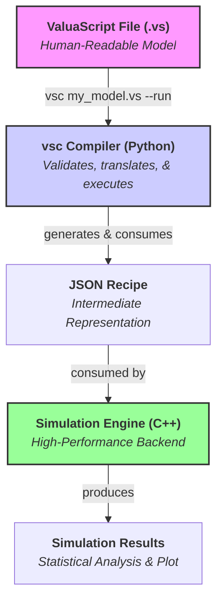

# ValuaScript & The Quantitative Simulation Engine

[](https://github.com/Alessio2704/monte-carlo-simulator/actions)
[](https://opensource.org/licenses/MIT)
[](https://isocpp.org/std/the-standard)
[](https://www.python.org/downloads/)

**A high-performance, multithreaded C++ engine for quantitative financial modeling, driven by ValuaScript—a simple, dedicated scripting language with a smart, validating compiler.**

## 📖 About The Project

This project was born from the need to bridge the gap between the intuitive but slow nature of spreadsheet-based financial modeling and the powerful but often verbose nature of general-purpose programming languages. The goal is to provide a platform that offers the **usability** of a dedicated modeling language with the **raw performance** of compiled, multithreaded C++.

It is designed to execute complex, multi-year, stochastic financial models, running hundreds of thousands of Monte Carlo simulations in seconds—a task that would take minutes or hours in traditional tools.

### Key Features

- **✨ Simple & Intuitive Language:** Models are defined in **ValuaScript (`.vs`)**, a clean, declarative language with a **familiar, spreadsheet-like formula syntax** using standard mathematical operators (`+`, `-`, `*`, `/`, `^`).
- **🚀 High-Performance Backend:** A core engine written in modern C++17, fully multithreaded to leverage all available CPU cores for maximum simulation speed.
- **🐍 Smart Validating Compiler:** A robust compiler, `vsc`, transpiles ValuaScript into a JSON recipe. It provides **clear, user-friendly error messages** and performs advanced **static type inference** to catch logical errors before execution.
- **⚙️ Streamlined Workflow:** A `--run` flag allows for a seamless, one-step compile-and-execute experience.
- **📊 Instant Visualization:** A `--plot` flag automatically generates a histogram of the simulation output, providing immediate visual analysis.
- **📈 Data Export:** Natively supports exporting full simulation trial data to CSV files for further analysis with the `@output_file` directive.
- **🎲 Integrated Monte Carlo Simulation:** Natively supports a rich library of statistical distributions (`Normal`, `Pert`, `Lognormal`, etc.) with fully validated parameters.
- **🛡️ Robust & Tested:** Comprehensive unit test suite for both the C++ engine (GoogleTest) and the Python compiler (Pytest), ensuring correctness and stability.

## 🏛️ Architecture

The project is cleanly separated into two main components: a Python **compiler** and a C++ **engine**. This modular structure separates the user-facing language tools from the high-performance computation core.



## 🚀 Getting Started

There are two paths for using this project: as an **End-User** (recommended for most) or as a **Developer**.

### For End-Users

1.  **Download the `vsc` Compiler:**
    Go to the [**latest GitHub Release**](https://github.com/Alessio2704/monte-carlo-simulator/releases) and download the `vsc` executable for your operating system. Place it in a convenient location.

2.  **Build the C++ Engine:**
    You only need to do this once. First, ensure you have [Git](https://git-scm.com/), [CMake](https://cmake.org/), and a C++17 compiler installed.

    ```bash
    # Clone the repository
    git clone https://github.com/Alessio2704/monte-carlo-simulator.git
    cd monte-carlo-simulator

    # Configure and build the project from the root directory
    cmake -B build
    cmake --build build
    ```

    This creates the `monte-carlo-simulator` executable inside the top-level `build/bin/` directory.

3.  **Configure the `--run` Flag (One-Time Setup):**
    To use the streamlined workflow, you need to tell the `vsc` compiler where to find the C++ engine you just built. Follow the platform-specific instructions in the **"Configuring the `--run` Flag"** section below.

### Full Workflow Example

Once set up, you can compile, run, and visualize a simulation with a single command:

1.  **Write a model** in a file named `my_model.vs`. Make sure it includes an `@output_file` directive.
2.  **Compile, run, and plot it:**
    ```bash
    # This will compile my_model.vs to my_model.json,
    # execute the simulation, save results to the specified CSV,
    # and finally display a histogram of the results.
    /path/to/downloaded/vsc my_model.vs --run --plot
    ```

---

## ⚙️ Configuring the `--run` Flag

To make `vsc my_model.vs --run` work seamlessly, you need to tell the `vsc` compiler where to find the `monte-carlo-simulator` executable. The recommended method is to set an environment variable. This is a one-time setup.

First, get the **absolute path** to your C++ engine executable. After building, you can find this by navigating to the `build/bin` directory and running `pwd` (on macOS/Linux) or copying the path from File Explorer (on Windows).

- Example path on macOS/Linux: `/Users/yourname/monte-carlo-simulator/build/bin/monte-carlo-simulator`
- Example path on Windows: `C:\Users\yourname\monte-carlo-simulator\build\bin\monte-carlo-simulator.exe`

<details>
<summary><b>Click for macOS & Linux Instructions (Zsh/Bash)</b></summary>

1.  **Open your shell configuration file.** This is typically `~/.zshrc` for Zsh (default on modern macOS) or `~/.bash_profile` or `~/.bashrc` for Bash.
    ```bash
    # For Zsh
    open ~/.zshrc
    ```
2.  **Add the `export` command.** Go to the very bottom of the file and add the following line, replacing the example path with your own.

    ```bash
    # Set the path for the ValuaScript Simulation Engine
    export VSC_ENGINE_PATH="/Users/yourname/monte-carlo-simulator/build/bin/monte-carlo-simulator"
    ```

3.  **Save the file and apply the changes** by running `source ~/.zshrc` or by opening a new terminal window.

</details>

<details>
<summary><b>Click for Windows Instructions</b></summary>

1.  **Open Environment Variables:** Open the Start Menu, type "env", and select "Edit the system environment variables".
2.  **Edit User Variables:** In the window that appears, click the "Environment Variables..." button. In the top section ("User variables for yourname"), click "New...".
3.  **Create the Variable:**
    - **Variable name:** `VSC_ENGINE_PATH`
    - **Variable value:** `C:\Users\yourname\monte-carlo-simulator\build\bin\monte-carlo-simulator.exe` (replace with your actual path)
4.  **Confirm:** Click OK on all the windows to close them. You must **open a new Command Prompt or PowerShell terminal** for the changes to take effect.

</details>

<details>
<summary><b>Alternative Methods (for advanced users)</b></summary>

The `vsc` compiler searches for the engine in this order:

1.  A path specified with the `--engine-path` flag (e.g., `vsc model.vs --run --engine-path /path/to/engine`).
2.  The `VSC_ENGINE_PATH` environment variable (recommended setup).
3.  A known relative path (`../../build/bin/monte-carlo-simulator` from `compiler/vsc/`), which works out-of-the-box for developers running `vsc` from within the Python package source.
4.  The system's `PATH` variable.

</details>

---

### For Developers (Building Everything from Source)

<details>
<summary>Click to expand developer instructions</summary>

First, build the C++ engine using the end-user instructions. The developer workflow assumes the engine has been built and its artifacts are in the top-level `/build` directory.

Then, set up the Python environment for the compiler:

```bash
# Navigate to the compiler's directory
cd compiler

# Create and activate a virtual environment
python3 -m venv venv
source venv/bin/activate

# Install the vsc package in editable mode and its dependencies
pip install -e .
```

The `vsc` command is now available in your shell. For developers, the `--run` flag will work automatically without any extra configuration, as the compiler will find the engine at the known relative path from the `compiler/` directory to the `build/` directory.

</details>

## 📜 ValuaScript Language Guide

ValuaScript uses a simple, line-by-line syntax for defining variables and calculations. The compiler enforces a clean, readable style.

#### Settings

Special `@` directives configure the simulation. They can appear anywhere in the file but are typically placed at the top for clarity.

```valuascript
# Defines the number of Monte Carlo trials to run. (Required)
@iterations = 100000

# Specifies which variable's final value should be collected. (Required)
@output = final_share_price

# Exports all trial results to a CSV for analysis and plotting. (Optional)
@output_file = "sim_results/amazon_model.csv"
```

#### Variable Assignment (`let`)

Use the `let` keyword to define variables. The compiler executes assignments sequentially and infers the type of each variable (`scalar` or `vector`).

**1. Literals (Scalars and Vectors)**

```valuascript
let tax_rate = 0.21              # Inferred as 'scalar'
let margin_forecast = [0.25, 0.26] # Inferred as 'vector'
```

**2. Infix Expressions**
ValuaScript supports standard mathematical operators for calculations, with correct precedence (`^` before `*`/`/`, before `+`/`-`). Parentheses `()` can be used to control the order of evaluation.

```valuascript
# The compiler infers the types of the variables and the final result.
let cost_of_equity = risk_free_rate + beta * equity_risk_premium
```

**3. Function Calls**
For more complex logic, the engine provides a rich library of built-in functions. The compiler performs advanced, recursive type checking on all function calls:

- The number of arguments must be correct.
- The type of each argument (`scalar` or `vector`) must match the function's signature. This includes the results of nested function calls.

```valuascript
# CORRECT: The result of grow_series (a vector) is a valid argument for sum_series.
let total_sales = sum_series(grow_series(100, 0.1, 5))

# INCORRECT: The result of grow_series (a vector) is not a valid argument
# for the 'mean' parameter of Normal, which expects a scalar.
# THIS WILL CAUSE A COMPILER ERROR:
# let random_value = Normal(grow_series(100, 0.1, 5), 10)
```

## 🔬 Development & Contribution

Contributions are welcome! The project's clean separation into `engine/` and `compiler/` directories makes it highly extensible.

### Running Tests

The project includes comprehensive test suites for both components.

**1. C++ Engine Tests (GoogleTest)**

```bash
# First, build the project from the root directory (see "Getting Started")
# Then, run the test executable
./build/bin/run_tests
```

**2. Python Compiler Tests (Pytest)**

```bash
# Navigate to the compiler directory
cd compiler

# Activate your virtual environment if not already active
source venv/bin/activate

# Install pytest if needed
pip install pytest

# Run the tests
pytest -v
```

### Extending the Engine: A Detailed Guide

Adding a new function to ValuaScript is a clean, three-stage process that touches the C++ engine, the Python compiler, and their respective test suites. This ensures that every new function is not only implemented correctly but also fully validated and type-checked by the compiler.

Let's walk through a complete example: we will add a new function `clip(value, min_val, max_val)` that constrains a value to be within a specified range.

---

#### Stage 1: Implement the Core Logic in the C++ Engine

First, we'll add the C++ class that performs the actual calculation.

**1.1. Add the `IExecutable` Class**

Open the header file where other simple operations are defined:
**File:** `engine/include/engine/operations.h`

At the end of the file, before the final `#endif` or `#pragma once`, add the new `ClipOperation` class. We can use `std::clamp` (available in C++17) for a clean implementation.

```cpp
// Add this to the end of engine/include/engine/operations.h

class ClipOperation : public IExecutable
{
public:
    TrialValue execute(const std::vector<TrialValue> &args) const override
    {
        if (args.size() != 3)
        {
            throw std::runtime_error("ClipOperation requires 3 arguments: value, min_val, max_val.");
        }
        // The compiler has already guaranteed these are scalars, so we can safely use std::get.
        double value = std::get<double>(args[0]);
        double min_val = std::get<double>(args[1]);
        double max_val = std::get<double>(args[2]);

        return std::clamp(value, min_val, max_val);
    }
};
```

**1.2. Register the New Function in the Factory**

Now, we need to tell the simulation engine that the string `"clip"` in a JSON recipe should map to our new `ClipOperation` class.

Open the engine's main source file:
**File:** `engine/src/engine/SimulationEngine.cpp`

Find the `build_executable_factory()` method and add a new entry for `"clip"`. The list is alphabetical, so let's place it there.

```cpp
// In engine/src/engine/SimulationEngine.cpp, inside build_executable_factory()

void SimulationEngine::build_executable_factory()
{
    // ... other operations
    m_executable_factory["capitalize_expense"] = []
    { return std::make_unique<CapitalizeExpenseOperation>(); };

    // Add our new line here
    m_executable_factory["clip"] = []
    { return std::make_unique<ClipOperation>(); };

    m_executable_factory["compound_series"] = []
    { return std::make_unique<CompoundSeriesOperation>(); };
    // ... other operations
}
```

At this point, the C++ engine is now capable of executing the `clip` function.

---

#### Stage 2: Teach the Python Compiler About the New Function

Next, we must update the compiler's configuration so it can validate calls to `clip`.

**2.1. Add the Function Signature**

Open the compiler's static configuration file:
**File:** `compiler/vsc/config.py`

Find the `FUNCTION_SIGNATURES` dictionary and add an entry for `"clip"`. This entry tells the validator everything it needs to know: the number of arguments, their expected types, and the type of the value it returns.

```python
# In compiler/vsc/config.py, inside FUNCTION_SIGNATURES

FUNCTION_SIGNATURES = {
    # ... other functions
    "Beta": {"variadic": False, "arg_types": ["scalar", "scalar"], "return_type": "scalar"},

    # Add our new signature here (alphabetically)
    "clip": {"variadic": False, "arg_types": ["scalar", "scalar", "scalar"], "return_type": "scalar"},

    "compound_series": {"variadic": False, "arg_types": ["scalar", "vector"], "return_type": "vector"},
    # ... other functions
}
```

- `"variadic": False`: `clip` takes a fixed number of arguments.
- `"arg_types": ["scalar", "scalar", "scalar"]`: It requires three arguments, all of which must be scalars. The compiler will now enforce this.
- `"return_type": "scalar"`: The result of `clip` is a single number, so its type is `scalar`. This is crucial for type inference in larger expressions.

---

#### Stage 3: Add Comprehensive Tests

The final and most critical stage is to add tests that verify both the C++ logic and the Python validation rules.

**3.1. Add C++ Unit Tests (GoogleTest)**

We'll add tests to verify the core logic: that `clip` correctly constrains values.

Open the C++ test file:
**File:** `engine/test/engine_tests.cpp`

Find the `MathOperationTests` test suite and add a few test cases for `clip`. We'll add them to the `INSTANTIATE_TEST_SUITE_P` block.

```cpp
// In engine/test/engine_tests.cpp

INSTANTIATE_TEST_SUITE_P(
    MathOperationTests,
    DeterministicEngineTest,
    ::testing::Values(
        // ... all the existing math tests
        std::make_tuple(R"({"simulation_config":{"num_trials":1},"output_variable":"B","execution_steps":[{"type":"literal_assignment","result":"A","value":0},{"type":"execution_assignment","result":"B","function":"tan","args":["A"]}]})", TrialValue(std::tan(0.0)), false),

        // Add our new test cases for clip()
        // Case 1: Value is below the minimum, should be clipped up
        std::make_tuple(R"({"simulation_config":{"num_trials":1},"output_variable":"X","execution_steps":[{"type":"execution_assignment","result":"X","function":"clip","args":[5, 10, 20]}]})", TrialValue(10.0), false),
        // Case 2: Value is within the range, should be unchanged
        std::make_tuple(R"({"simulation_config":{"num_trials":1},"output_variable":"X","execution_steps":[{"type":"execution_assignment","result":"X","function":"clip","args":[15, 10, 20]}]})", TrialValue(15.0), false),
        // Case 3: Value is above the maximum, should be clipped down
        std::make_tuple(R"({"simulation_config":{"num_trials":1},"output_variable":"X","execution_steps":[{"type":"execution_assignment","result":"X","function":"clip","args":[25, 10, 20]}]})", TrialValue(20.0), false)
    ));
```

**3.2. Add Python Compiler Tests (Pytest)**

Now, we test the compiler's validation rules.

Open the Python test file:
**File:** `compiler/tests/test_compiler.py`

- **Add a "happy path" test** to ensure a valid call compiles successfully.

```python
# In test_compiler.py, inside test_valid_scripts_compile_successfully()

def test_valid_scripts_compile_successfully():
    # ... other valid scripts
    compile_and_validate("@iterations=1\n@output=x\nlet x = sum_series(grow_series(1, 1, 1))")
    # Add a test for our new clip function
    compile_and_validate("@iterations=1\n@output=x\nlet x = clip(100, 0, 50)")
```

- **Add a "sad path" test** for a type error. The arity (argument count) tests will be handled automatically by the existing `get_arity_test_cases` fixture, but we should add a specific test for passing a wrong type, like a vector.

```python
# In test_compiler.py, add a new entry to the test_semantic_and_type_errors parameters

@pytest.mark.parametrize(
    "description, script_body, expected_error",
    [
        # ... other error cases
        ("Wrong @output_file type", "@iterations=1\n@output=x\nlet x=1\n@output_file=123", "must be a string literal"),
        # Add our new type error test case
        ("Wrong type for clip", "let result=clip([1,2], 0, 10)", "expects a 'scalar', but got a 'vector'"),
    ],
)
def test_semantic_and_type_errors(base_script, description, script_body, expected_error):
    # ... test body remains the same
```

---

#### Final Step: Build and Test

You are now done! To confirm everything works:

1.  Navigate to the project root.
2.  Re-build the C++ engine: `cmake --build build`
3.  Run the C++ tests: `./build/bin/run_tests`
4.  Run the Python tests: `cd compiler && pytest`

Both test suites should pass, confirming your new `clip` function is correctly implemented, integrated, and validated. You have successfully extended the ValuaScript language.

## 🗺️ Roadmap

The project is actively developed. Our current roadmap prioritizes practical utility and user experience.

### ✅ Completed Milestones

- **V1.0:** Core C++ Engine & ValuaScript Compiler.
- **V1.1:** Compiler with full type inference & robust error reporting.
- **V1.2:**
  - Streamlined `--run` flag.
  - Data export via `@output_file` and CSV writing.
  - Instant visualization via `--plot` flag.
- **V1.3 (Current):** Major architectural refactor into modular `compiler` and `engine` directories.

---

### 🔜 Tier 1: Next Immediate Feature

- [ ] **External Data Integration (CSV Reading)**
  - **Why:** To enable models to use real-world data (e.g., historical financials, assumption sets) from external files. This is a critical feature for any serious modeling tool, moving beyond hardcoded assumptions.
  - **How:** To ensure clarity and simple, robust validation, we will implement two distinct functions:
    - `read_csv_vector(file_path, column_name)` -> **vector**: Reads an entire column from a CSV file and returns it as a vector. Used for importing time series data.
    - `read_csv_scalar(file_path, column_name, row_index)` -> **scalar**: Reads a single cell from a CSV at a specific column and row, returning it as a scalar. Used for importing individual configuration parameters.
  - **Implementation Steps:**
    1.  **Engine:** Add a robust C++ CSV parsing library. Implement two new classes, `ReadCsvVectorOperation` and `ReadCsvScalarOperation`, inheriting from `IExecutable`. The engine should intelligently cache opened CSV files to avoid redundant disk I/O. Register these in the `SimulationEngine` factory.
    2.  **Compiler:** Add two new, distinct signatures to `FUNCTION_SIGNATURES`:
        - `"read_csv_vector": {"variadic": False, "arg_types": ["string", "string"], "return_type": "vector"}`
        - `"read_csv_scalar": {"variadic": False, "arg_types": ["string", "string", "scalar"], "return_type": "scalar"}`

### ⏩ Tier 2: Improving the User Experience

- [ ] **VS Code Extension**

  - **Why:** To transform the model-writing process from editing plain text to working in a smart environment. This dramatically lowers the barrier to entry and improves productivity.
  - **How:**
    1.  **Phase 1 (Easy):** Implement syntax highlighting for `.vs` files and snippets for common functions.
    2.  **Phase 2 (Advanced):** Develop a Language Server that uses the `vsc` compiler package to provide real-time error checking (linting) and diagnostics directly in the editor.

- [ ] **Empirical Distribution Sampler (`create_sampler_from_data`)**

  - **Why:** Models often require inputs that follow a specific, but not standard, distribution. Instead of forcing users to guess (`Normal`? `Lognormal`?), this feature would allow them to create a custom sampler directly from a real-world data series (e.g., historical oil prices, stock returns). This grounds the simulation in empirical evidence, significantly improving model realism.
  - **User-Facing Syntax:**

    ```valuascript
    # 1. Read the historical data from a CSV file.
    let oil_price_history = read_csv_vector("data/oil_prices.csv", "Price")

    # 2. Create a custom sampler based on that data's distribution.
    let oil_price_sampler = create_sampler_from_data(oil_price_history)

    # 3. Use the sampler like any other distribution (e.g., Normal, Pert).
    # Each time this line is executed in a trial, it will draw a new value
    # from the custom distribution.
    let future_oil_price = oil_price_sampler()
    ```

  - **How It Works (Implementation):**
    1.  **`create_sampler_from_data` Function:** This new function would take a `vector` as input. Instead of returning a `scalar` or `vector`, it would return a new, special type we could call a **`sampler`**. This `sampler` is essentially a handle or an ID that refers to the created distribution.
    2.  **Engine Implementation:** When `create_sampler_from_data` is executed, the C++ engine would analyze the input vector and store its statistical properties. The simplest and most common method for this is to create a **Kernel Density Estimate (KDE)** or simply store the empirical data points for resampling (a method called **bootstrapping**).
    3.  **Using the Sampler:** When the user calls `oil_price_sampler()`, the engine recognizes the variable is of type `sampler`. Instead of treating it as a value, it executes the sampling logic associated with that handle, drawing a random value from the stored empirical distribution.
    4.  **Compiler Support:** This is a significant language extension. The compiler would need to:
        - Recognize the new `sampler` type.
        - Add a new syntax for "calling" a sampler variable (e.g., `variable_name()`).
        - Update the type inference engine to handle this new type and its usage.

### 🚀 Tier 3: Advanced Language Features

- [ ] **Modularization (`@import` / `@export`)**
  - **Why:** To allow users to create reusable, importable modules (e.g., a standard WACC calculation). This promotes cleaner, more abstract, and more scalable models, avoiding code duplication.
  - **How:** This is a major architectural evolution for the compiler. It will require implementing a dependency graph, handling namespaces (to prevent variable collisions), and defining a clear contract for how modules pass arguments and return values.

### 🌌 V-Next: The "Blue Sky" Goal (JIT Compilation)

- [ ] **Native Code Generation (JIT Compiler)**
  - **Why:** The ultimate performance goal. While the current C++ engine is extremely fast, it still operates by interpreting the JSON recipe for each of the millions of trials. A Just-In-Time (JIT) compiler would represent the final evolution of the engine. It would take the JSON recipe, and at the start of the simulation, compile it _in memory_ into a highly optimized, native machine code function tailored to execute that specific model. This would eliminate all interpretation overhead, pushing the execution speed to the theoretical maximum—as if the model had been written directly in optimized C++.
  - **How:** This is a major undertaking, suitable for a future V2.0 or V3.0 release, once the current feature set is complete and stable. It would involve integrating a code generation library (like `asmjit` or even `LLVM`) into the C++ engine. The engine would transition from being an _interpreter_ of the JSON recipe to a _compiler_ that consumes the recipe and emits executable code. The choice of JSON as a clean, structured Intermediate Representation (IR) was a crucial first step that makes this future evolution possible.

## 📄 License

This project is distributed under the MIT License. See the `LICENSE` file for more information.
