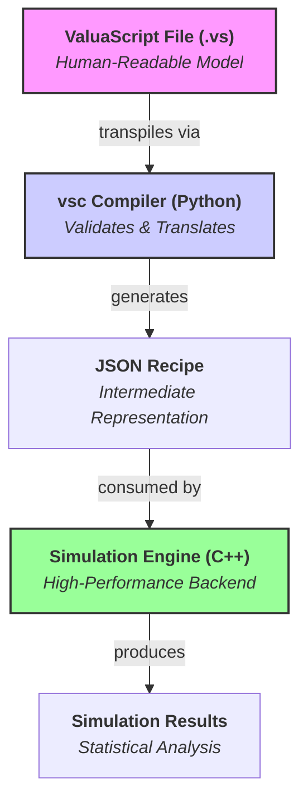

# ValuaScript & The Quantitative Simulation Engine

[](https://github.com/Alessio2704/monte-carlo-simulator/actions)
[](https://opensource.org/licenses/MIT)
[](https://isocpp.org/std/the-standard)
[](https://www.python.org/downloads/)

**A high-performance, multithreaded C++ engine for quantitative financial modeling, driven by ValuaScript—a simple, dedicated scripting language.**

## 📖 About The Project

This project was born from the need to bridge the gap between the intuitive but slow nature of spreadsheet-based financial modeling and the powerful but often verbose nature of general-purpose programming languages. The goal is to provide a platform that offers the **usability** of a dedicated modeling language with the **raw performance** of compiled, multithreaded C++.

It is designed to execute complex, multi-year, stochastic financial models, running hundreds of thousands of Monte Carlo simulations in seconds—a task that would take minutes or hours in traditional tools.

### Key Features

- **✨ Simple & Intuitive Language:** Models are defined in **ValuaScript (`.vs`)**, a clean, declarative language with a **familiar, spreadsheet-like formula syntax** using standard mathematical operators (`+`, `-`, `*`, `/`, `^`).
- **🚀 High-Performance Backend:** A core engine written in modern C++17, fully multithreaded to leverage all available CPU cores for maximum simulation speed.
- **🐍 Smart Python Compiler:** A robust compiler, `vsc`, transpiles ValuaScript into a JSON recipe, providing clear, semantic error-checking before execution.
- **🎲 Integrated Monte Carlo Simulation:** Natively supports a rich library of statistical distributions (`Normal`, `Pert`, `Lognormal`, etc.) with fully dynamic parameters.
- **📈 Time-Series Aware:** Built from the ground up to handle multi-year forecasts, with operations for growth series, NPV, and element-wise vector math.
- **🛡️ Robust & Tested:** Comprehensive unit test suite built using GoogleTest, ensuring the correctness of all C++ engine features.

## 🏛️ Architecture

The platform is built on a clean, three-layer architecture that separates human-readable modeling from high-speed computation.



1.  **ValuaScript (Frontend):** A user defines their model in a simple `.vs` file.
2.  **`vsc` Compiler (Middleware):** The Python-based `vsc` tool reads the `.vs` file, validates its logic, and transpiles it into a structured JSON "recipe."
3.  **Simulation Engine (Backend):** The multithreaded C++ `monte-carlo-simulator` executable reads the JSON recipe and acts as a high-speed, sequential interpreter to run the simulation.

## 🚀 Getting Started

There are two paths for using this project: as an **End-User** (recommended for most) or as a **Developer** (if you want to contribute).

### For End-Users (The Easy Way)

This path allows you to write models and run simulations without setting up a Python environment.

1.  **Download the `vsc` Compiler:**
    Go to the [**latest GitHub Release**](https://github.com/Alessio2704/monte-carlo-simulator/releases) and download the `vsc` executable for your operating system.

2.  **Build the C++ Engine:**
    You only need to do this once. First, ensure you have [Git](https://git-scm.com/), [CMake](https://cmake.org/), and a C++17 compiler installed.

    ```bash
    # Clone the repository
    git clone https://github.com/Alessio2704/monte-carlo-simulator.git
    cd monte-carlo-simulator

    # Configure and build the C++ engine
    cmake -B build
    cmake --build build
    ```

    This creates the `monte-carlo-simulator` executable inside the `build/bin/` directory.

### Full Workflow Example

With the setup complete, you can now write, compile, and run models.

1.  **Write a model** in a file named `my_model.vs`.
2.  **Compile it** using the `vsc` executable you downloaded:
    ```bash
    # This creates my_model.json
    /path/to/downloaded/vsc my_model.vs
    ```
3.  **Run the simulation** with the C++ engine:
    ```bash
    ./build/bin/monte-carlo-simulator my_model.json
    ```

---

### For Developers (Building Everything from Source)

<details>
<summary>Click to expand developer instructions</summary>

This path is for those who wish to modify the compiler or the C++ engine.

#### 📋 Prerequisites

- **Git:** To clone the repository.
- **C++ Compiler (C++17):** e.g., Clang, GCC, or MSVC.
- **CMake (3.14+):** To build the C++ engine.
- **Python (3.7+):** To build and run the `vsc` compiler from source.

#### 🛠️ Build Instructions

1.  **Clone the Repository:**
    ```bash
    git clone https://github.com/Alessio2704/monte-carlo-simulator.git
    cd monte-carlo-simulator
    ```
2.  **Build the C++ Engine:**
    ```bash
    cmake -B build
    cmake --build build
    ```
3.  **Build and Install the `vsc` Compiler:**
    ```bash
    cd compiler
    # Create a virtual environment
    python3 -m venv venv
    source venv/bin/activate
    # Install in editable mode
    pip install -e .
    ```
    The `vsc` command is now available in your shell as long as the virtual environment is active.

</details>

## 📜 ValuaScript Language Guide

ValuaScript uses a simple, line-by-line syntax for defining variables and calculations.

#### Settings

Special directives configure the simulation. They are required.

```valuascript
@iterations = 100000
# ... model logic ...
@output = final_share_price
```

#### Variable Assignment (`let`)

Use the `let` keyword to define variables. The engine executes assignments sequentially.

**1. Fixed Values (Scalars and Vectors)**

```valuascript
let tax_rate = 0.21
let margin_forecast = [0.25, 0.26, 0.27]
```

**2. Stochastic Variables (Distributions)**

```valuascript
let growth_rate = Normal(0.08, 0.02)
let wacc = Pert(0.08, 0.09, 0.10)
```

_Supported Distributions:_ `Normal`, `Pert`, `Uniform`, `Lognormal`, `Triangular`, `Bernoulli`, `Beta`.

**3. Operations and Expressions**
ValuaScript supports standard mathematical operators for calculations, with correct precedence (`^` is evaluated before `*`/`/`, which are evaluated before `+`/`-`). Parentheses `()` can be used to control the order of evaluation.

For more complex logic, the engine provides a rich library of built-in functions.

```valuascript
# Infix operators for simple arithmetic
let cost_of_equity = risk_free_rate + beta * equity_risk_premium

# Parentheses for correct order of operations
let nopat = EBIT * (1 - tax_rate)

# Complex logic still uses functions
let revenue_series = grow_series(base_revenue, growth_rate, 10)

# You can combine both in a single expression
let pv_terminal_value = npv(wacc, cash_flows) / (1 + wacc) ^ num_years
```

## 🔬 Development & Contribution

Contributions are welcome! The project is designed to be highly extensible.

### Running Tests

The project includes a comprehensive C++ unit test suite.

```bash
# First, build the project (see instructions above)
./build/bin/run_tests
```

### Extending the Engine

<details>
<summary>Click to see instructions for adding new functions (Distributions or Operations)</summary>

The new architecture makes adding any function (`Sampler` or `Operation`) a simple, unified process.

1.  **Define the Logic (C++):** In `include/engine/samplers.h` or `include/engine/operations.h`, create a new class (e.g., `NewFunction`) that inherits from `IExecutable` and implements the `TrialValue execute(const std::vector<TrialValue>& args) const` method.
2.  **Register in Factory (C++):** In `src/engine/SimulationEngine.cpp`, go to the `build_executable_factory` method and add a new entry to the map:
    ```cpp
    m_executable_factory["new_function_name"] = [] { return std::make_unique<NewFunction>(); };
    ```
3.  **Register in Compiler (Python):** In `compiler/vsc.py`, add the `"new_function_name"` to the `VALID_FUNCTIONS` set.
4.  **Add a Test (C++):** In `test/engine_tests.cpp`, add a new test case to the appropriate `INSTANTIATE_TEST_SUITE_P` block to validate your new function's logic.

</details>

## 🗺️ Roadmap

The core platform is complete and functional. Future development will focus on improving the user experience, adding advanced features, and enhancing the development ecosystem.

- [x] **V1.0 C++ Engine Core & ValuaScript Compiler**
  - [x] Designed ValuaScript language and grammar
  - [x] Built robust Python compiler (`vsc`) with semantic validation
  - [x] Engineered a sequential, multithreaded C++17 execution engine
  - [x] Achieved comprehensive test coverage with GoogleTest
  - [x] Packaged compiler for distribution (source and standalone)

---

### Tier 1: Polish and Testing (V1.1)

<details>
<summary>These are immediate goals to improve the robustness and usability of the current version.</summary>

- [ ] **Compiler Test Suite:**
  - [ ] Implement a test suite for the `vsc` compiler using `pytest`.
- [ ] **Improved Error Reporting:**
  - [ ] Enhance the compiler to report the line and column number where an error occurred.
- [ ] **Official "Examples" Directory:**
  - [ ] Create a top-level `/examples` directory with real-world model examples.
  </details>

### Tier 2: Major Features (V1.2+)

<details>
<summary>These features will significantly expand the capabilities of the platform.</summary>

- [ ] **External Data Integration:**
  - [ ] Add a `read_csv("path", "column")` function to ValuaScript to allow models to use external data sources.
  - [ ] Implement the corresponding `Operation` in the C++ engine.
- [ ] **Streamlined Workflow:**
  - [ ] Add a `--run` flag to the `vsc` compiler.
  - [ ] When `--run` is used, `vsc` will automatically execute the `monte-carlo-simulator` with the newly generated JSON file.
- [ ] **Enhanced Output Options:**
  - [ ] Add a `@output_file = "results.csv"` directive to ValuaScript.
  - [ ] Update the C++ engine to write all trial results to the specified CSV file for further analysis in tools like Excel, Python, or R.

</details>

### Tier 3: Ecosystem and Distribution (V2.0)

<details>
<summary>Long-term goals focused on making the project more accessible and professional.</summary>

- [ ] **Automated Cross-Platform Builds (CI/CD):**
  - [ ] Create a GitHub Actions workflow to automatically build the C++ engine and the standalone `vsc` executable for Windows, macOS, and Linux.
  - [ ] Configure the workflow to attach all binaries to new GitHub Releases automatically.
- [ ] **Dedicated Documentation Website:**
  - [ ] Use a static site generator like MkDocs or Docusaurus to create a full documentation website.
  - [ ] Host the site on GitHub Pages for a polished, professional look.

</details>

### The "Blue Sky" Vision

<details>
<summary>Ambitious, long-term ideas for a next-generation modeling tool.</summary>

- [ ] **VS Code Extension:**
  - [ ] Develop an extension for Visual Studio Code providing syntax highlighting for `.vs` files.
  - [ ] Implement real-time error checking (linting) and autocompletion for ValuaScript functions.
- [ ] **Data Visualization:**
  - [ ] Add a feature to automatically generate and display a histogram of the final output distribution after a simulation run.

</details>

## 📄 License

This project is distributed under the MIT License. See the `LICENSE` file for more information.
