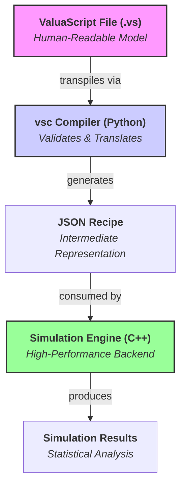

# ValuaScript & The Quantitative Simulation Engine

[](https://github.com/your-username/your-repo/actions)
[](https://opensource.org/licenses/MIT)
[](https://isocpp.org/std/the-standard)
[](https://www.python.org/downloads/)

**A high-performance, multithreaded C++ engine for quantitative financial modeling, driven by ValuaScript—a simple, dedicated scripting language.**

## 📖 About The Project

This project was born from the need to bridge the gap between the intuitive but slow nature of spreadsheet-based financial modeling and the powerful but often verbose nature of general-purpose programming languages. The goal is to provide a platform that offers the **usability** of a dedicated modeling language with the **raw performance** of compiled, multithreaded C++.

It is designed to execute complex, multi-year, stochastic financial models, running hundreds of thousands of Monte Carlo simulations in seconds—a task that would take minutes or hours in traditional tools.

### Key Features

- **✨ Simple & Intuitive Language:** Models are defined in **ValuaScript (`.vs`)**, a clean, declarative language designed specifically for finance.
- **🚀 High-Performance Backend:** A core engine written in modern C++17, fully multithreaded to leverage all available CPU cores for maximum simulation speed.
- ** ट्रांसपाइलर Smart Python Compiler:** A robust compiler, `vsc`, transpiles ValuaScript into a JSON recipe, providing clear, semantic error-checking before execution.
- **🎲 Integrated Monte Carlo Simulation:** Natively supports a rich library of statistical distributions (`Normal`, `Pert`, `Lognormal`, etc.) for any input variable.
- **📈 Time-Series Aware:** Built from the ground up to handle multi-year forecasts, with operations for growth series, NPV, and element-wise vector math.
- **🛡️ Robust & Tested:** Comprehensive unit test suite built using GoogleTest, ensuring the correctness of all C++ engine features.

## 🏛️ Architecture

The platform is built on a clean, three-layer architecture that separates human-readable modeling from high-speed computation.



1.  **ValuaScript (Frontend):** A user defines their model in a simple `.vs` file.
2.  **`vsc` Compiler (Middleware):** The Python-based `vsc` tool reads the `.vs` file, validates its logic, and transpiles it into a structured JSON "recipe."
3.  **Simulation Engine (Backend):** The multithreaded C++ `monte-carlo-simulator` executable reads the JSON recipe and acts as a high-speed "interpreter" to run the simulation.

## 🚀 Getting Started

There are two paths to using this project: as an **End-User** (recommended for most) or as a **Developer** (if you want to contribute).

### For End-Users (The Easy Way)

This path allows you to write models and run simulations without setting up a Python environment.

1.  **Download the `vsc` Compiler:**
    Go to the [**latest GitHub Release**](https://github.com/your-username/your-repo/releases) and download the `vsc` executable for your operating system.

2.  **Build the C++ Engine:**
    You only need to do this once. First, ensure you have [Git](https://git-scm.com/), [CMake](https://cmake.org/), and a [C++17 compiler](#-prerequisites) installed.

    ```bash
    # Clone the repository
    git clone https://github.com/Alessio2704/monte-carlo-simulator
    cd monte-carlo-simulator

    # Configure and build the C++ engine
    cmake -B build
    cmake --build build
    ```

    This creates the `monte-carlo-simulator` executable inside the `build/bin/` directory.

### Full Workflow Example

With the setup complete, you can now write, compile, and run models.

1.  **Write a model** in a file named `my_model.vs`.
2.  **Compile it** using the `vsc` executable you downloaded:
    ```bash
    # This creates my_model.json
    /path/to/downloaded/vsc my_model.vs
    ```
3.  **Run the simulation** with the C++ engine:
    ```bash
    ./build/bin/monte-carlo-simulator my_model.json
    ```

---

### For Developers (Building Everything from Source)

<details>
<summary>Click to expand developer instructions</summary>

This path is for those who wish to modify the compiler or the C++ engine.

#### 📋 Prerequisites

- **Git:** To clone the repository.
- **C++ Compiler (C++17):** e.g., Clang, GCC, or MSVC.
- **CMake (3.14+):** To build the C++ engine.
- **Python (3.7+):** To build and run the `vsc` compiler from source.

#### 🛠️ Build Instructions

1.  **Clone the Repository:**
    ```bash
    git clone https://github.com/Alessio2704/monte-carlo-simulator
    monte-carlo-simulator
    ```
2.  **Build the C++ Engine:**
    ```bash
    cmake -B build
    cmake --build build
    ```
3.  **Build and Install the `vsc` Compiler:**
    ```bash
    cd compiler
    # Create a virtual environment
    python3 -m venv venv
    source venv/bin/activate
    # Install in editable mode
    pip install -e .
    ```
    The `vsc` command is now available in your shell as long as the virtual environment is active.

</details>

## 📜 ValuaScript Language Guide

ValuaScript uses a simple, line-by-line syntax for defining variables and calculations.

#### Settings

Special directives configure the simulation. They are required.

```valuascript
@iterations = 100000
# ... model logic ...
@output = final_share_price
```

#### Variable Assignment (`let`)

Use the `let` keyword to define inputs and calculations.

**1. Fixed Values (Scalars and Vectors)**

```valuascript
let tax_rate = 0.21
let margin_forecast = [0.25, 0.26, 0.27, 0.28, 0.29]
```

**2. Stochastic Variables (Distributions)**

```valuascript
let growth_rate = Normal(0.08, 0.02)
let wacc = Pert(0.08, 0.09, 0.10)
```

_Supported Distributions:_ `Normal`, `Pert`, `Uniform`, `Lognormal`, `Triangular`, `Bernoulli`, `Beta`.

**3. Operations (Calculations)**
Operations are performed using functions. Expressions can be nested.

```valuascript
# Simple arithmetic
let total_capital = add(market_cap_equity, debt)

# Nested expression
let nopat = multiply(EBIT, subtract(1, tax_rate))

# Time-series functions
let revenue_series = grow_series(base_revenue, growth_rate, 10)
let terminal_value = npv(wacc, cash_flows)
```

## 🔬 Development & Contribution

Contributions are welcome! The project is designed to be highly extensible.

### Running Tests

The project includes a comprehensive C++ unit test suite.

```bash
# First, build the project (see instructions above)
./build/bin/run_tests
```

### Extending the Engine

<details>
<summary>Click to see instructions for adding new Distributions or Operations</summary>

#### Adding a New Distribution

1.  **C++ Class:** Create `NewDistribution.h` and `.cpp` files, inheriting from `IDistribution`.
2.  **C++ Enum:** Add `NewDistribution` to the `DistributionType` enum in `include/engine/datastructures.h`.
3.  **C++ Map:** Add the JSON string mapping in `STRING_TO_DIST_TYPE_MAP` in `src/engine/SimulationEngine.cpp`.
4.  **C++ Factory:** Add the construction `case` in `create_distribution_from_input`.
5.  **Python Compiler:** Add the name and expected parameters to `DISTRIBUTION_PARAM_MAPPING` in `compiler/vsc.py`.
6.  **C++ Test:** Add a unit test in `test/distributions_tests.cpp`.

#### Adding a New Operation

1.  **C++ Class:** Create a `NewOperation` class in `include/engine/operations.h`, inheriting from `IOperation`.
2.  **C++ Enum:** Add `NEW_OPERATION` to the `OpCode` enum in `include/engine/datastructures.h`.
3.  **C++ Map:** Add the JSON string mapping in `STRING_TO_OPCODE_MAP`.
4.  **C++ Factory:** Add the `NewOperation` to the factory map in `build_operation_factory`.
5.  **Python Compiler:** Add the operation's name to the `VALID_OPERATIONS` set in `compiler/vsc.py`.
6.  **C++ Test:** Add a unit test in `test/engine_tests.cpp`.

</details>

## 🗺️ Roadmap

- [x] **V1.0 C++ Engine Core**
  - [x] Generic, data-driven architecture
  - [x] Full library of statistical distributions
  - [x] Time-series and vector math support
  - [x] Recursive expression evaluation
  - [x] Multithreaded execution
  - [x] Comprehensive unit test suite
- [x] **V1.1 ValuaScript Compiler**
  - [x] Defined final ValuaScript grammar using Lark
  - [x] Implemented Python-based transpiler to JSON
  - [x] Created robust command-line interface (`vsc`)
  - [x] Packaged for distribution (source and standalone)

## 📄 License

This project is distributed under the MIT License. See the `LICENSE` file for more information.