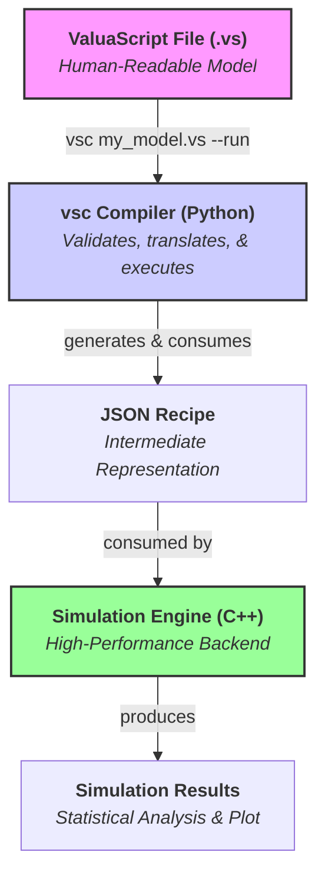

# ValuaScript & The Quantitative Simulation Engine

[](https://github.com/Alessio2704/monte-carlo-simulator/actions)
[](https://opensource.org/licenses/MIT)
[](https://isocpp.org/std/the-standard)
[](https://www.python.org/downloads/)

**A high-performance, multithreaded C++ engine for quantitative financial modeling, driven by ValuaScript—a simple, dedicated scripting language with a smart, validating compiler.**

## 📖 About The Project

This project was born from the need to bridge the gap between the intuitive but slow nature of spreadsheet-based financial modeling and the powerful but often verbose nature of general-purpose programming languages. The goal is to provide a platform that offers the **usability** of a dedicated modeling language with the **raw performance** of compiled, multithreaded C++.

It is designed to execute complex, multi-year, stochastic financial models, running hundreds of thousands of Monte Carlo simulations in seconds—a task that would take minutes or hours in traditional tools.

### Key Features

- **✨ Simple & Intuitive Language:** Models are defined in **ValuaScript (`.vs`)**, a clean, declarative language with a **familiar, spreadsheet-like formula syntax** using standard mathematical operators (`+`, `-`, `*`, `/`, `^`).
- **🚀 High-Performance Backend:** A core engine written in modern C++17, fully multithreaded to leverage all available CPU cores for maximum simulation speed.
- **🐍 Smart Validating Compiler:** A robust compiler, `vsc`, transpiles ValuaScript into a JSON recipe. It provides **clear, user-friendly error messages** and performs advanced **static type inference** to catch logical errors before execution.
- **⚙️ Streamlined Workflow:** A `--run` flag allows for a seamless, one-step compile-and-execute experience.
- **📊 Instant Visualization:** A `--plot` flag automatically generates a histogram of the simulation output, providing immediate visual analysis.
- **📈 Data Export:** Natively supports exporting full simulation trial data to CSV files for further analysis with the `@output_file` directive.
- **🎲 Integrated Monte Carlo Simulation:** Natively supports a rich library of statistical distributions (`Normal`, `Pert`, `Lognormal`, etc.) with fully validated parameters.
- **🛡️ Robust & Tested:** Comprehensive unit test suite for both the C++ engine (GoogleTest) and the Python compiler (Pytest), ensuring correctness and stability.

## 🏛️ Architecture

The project is cleanly separated into two main components: a Python **compiler** and a C++ **engine**. This modular structure separates the user-facing language tools from the high-performance computation core.

The compilation process now generates a structured JSON recipe with distinct execution phases, making the engine's job clear and scalable.



**Example JSON Recipe Structure:**
The compiler transforms a `.vs` script into a JSON recipe that the C++ engine can execute. This recipe explicitly separates one-time data loading steps from the core per-trial calculations.

```json
{
  "simulation_config": {
    "num_trials": 10000,
    "output_file": "results.csv"
  },
  "output_variable": "final_value",
  "pre_trial_steps": [
    {
      "type": "execution_assignment",
      "result": "assumptions",
      "function": "read_csv_vector",
      "args": [
        { "type": "string_literal", "value": "data.csv" },
        { "type": "string_literal", "value": "GrowthRate" }
      ]
    }
  ],
  "per_trial_steps": [
    {
      "type": "execution_assignment",
      "result": "random_growth",
      "function": "Normal",
      "args": [0.1, 0.02]
    }
  ]
}
```

## 🚀 Getting Started

This guide provides two paths for getting started: as an **End-User** who wants to use the tools, and as a **Developer** who wants to build the project from source.

### For End-Users (Recommended)

The easiest way to get started is to download the pre-compiled tools from the latest GitHub release. This allows you to use ValuaScript without needing to install any development tools.

1.  **Download the Tools:** Go to the [**latest GitHub Release**](https://github.com/Alessio2704/monte-carlo-simulator/releases).

    - Download the `vsc` compiler executable for your operating system.
    - Download the `vse` engine executable for your operating system.
    - Download the `valuascript-x.x.x.vsix` VS Code extension file.

2.  **Install the VS Code Extension:**

    - Open VS Code, go to the Extensions view, click the `...` menu, and select **"Install from VSIX..."**.
    - Select the `.vsix` file you downloaded.

3.  **Make the Tools Available:**
    - Place the `vsc` and `vse` executables in a single, convenient directory (e.g., `~/valuascript-tools/`).
    - Follow the instructions in the **"⚙️ Configuration"** section below to add this directory to your system's PATH. This is a one-time setup that makes the tools available from any terminal.

### For Developers (Building from Source)

This path is for users who want to contribute to the project or build everything from the source code.

#### 1. Install Prerequisites

First, ensure you have the necessary build tools for your operating system.

<details>
<summary><b>macOS Prerequisites</b></summary>

1.  **Install Command Line Tools:** This provides the C++ compiler (Clang).
    ```bash
    xcode-select --install
    ```
2.  **Install Homebrew:** Follow the instructions at [brew.sh](https://brew.sh/).
3.  **Install Git and CMake:**
    ```bash
    brew install git cmake
    ```
4.  **Install Python:** A recent version of Python 3 is required. You can install it via Homebrew (`brew install python`) or from [python.org](https://www.python.org/).

</details>

<details>
<summary><b>Linux (Debian/Ubuntu) Prerequisites</b></summary>

1.  **Install Build Tools:** This provides Git, the C++ compiler (GCC), and CMake.
    ```bash
    sudo apt update
    sudo apt install build-essential cmake git python3-pip python3-venv
    ```

</details>

<details>
<summary><b>Windows Prerequisites</b></summary>

1.  **Install Visual Studio 2019 or newer:** Download the free "Community" edition from the [Visual Studio website](https://visualstudio.microsoft.com/downloads/). During installation, you **must** select the **"Desktop development with C++"** workload.
2.  **Install Git:** Download and install [Git for Windows](https://git-scm.com/download/win).
3.  **Install CMake:** Download and run the installer from the [CMake website](https://cmake.org/download/). **Important:** During installation, select the option **"Add CMake to the system PATH for all users"** or "...for the current user".
4.  **Install Python:** Download and install a recent version of Python 3 from the [Microsoft Store](https://www.microsoft.com/p/python-310/9pjpw5ldxlz5) or [python.org](https://www.python.org/downloads/windows/). Ensure the option to "Add Python to PATH" is selected during installation.

</details>

#### 2. Clone and Build the Project

Once the prerequisites are installed, the build process is the same for all platforms.

```bash
# Clone the repository
git clone https://github.com/Alessio2704/monte-carlo-simulator.git
cd monte-carlo-simulator

# Configure and build the C++ engine from the root directory
cmake -B build
cmake --build build
```

This creates the `vse` executable inside the `build/bin/` directory.

#### 3. Install the Python Compiler

Follow the developer instructions to set up the Python environment and install the `vsc` compiler in editable mode.

---

## ⚙️ Configuration (One-Time Setup)

To use the tools seamlessly from any terminal, you need to tell your system where to find them.

### Method 1: Setting the `VSC_ENGINE_PATH` (Recommended)

This method is best if you only want to use the `--run` flag with the globally installed `vsc` compiler.

First, get the **absolute path** to your `vse` executable.

- **If you built from source:** The path will be something like `/path/to/monte-carlo-simulator/build/bin/monte-carlo-simulator`.
- **If you downloaded from a release:** It's the path to wherever you saved the executable.

<details>
<summary><b>macOS & Linux Instructions (Zsh/Bash)</b></summary>

1.  **Open your shell configuration file.** This is typically `~/.zshrc` for Zsh (default on modern macOS) or `~/.bashrc` for Bash.
    ```bash
    # For Zsh
    open ~/.zshrc
    ```
2.  **Add the `export` command.** Go to the very bottom of the file and add the following line, replacing the example path with your own absolute path.
    ```bash
    # Set the path for the ValuaScript Simulation Engine
    export VSC_ENGINE_PATH="/path/to/your/vse"
    ```
3.  **Save the file and apply the changes** by opening a **new terminal window** or by running `source ~/.zshrc`.

</details>

<details>
<summary><b>Windows Instructions</b></summary>

1.  **Open Environment Variables:** Open the Start Menu, type "env", and select "Edit the system environment variables".
2.  **Edit User Variables:** In the window that appears, click the "Environment Variables..." button. In the top section ("User variables for yourname"), click "New...".
3.  **Create the Variable:**
    - **Variable name:** `VSC_ENGINE_PATH`
    - **Variable value:** `C:\path\to\your\vse.exe` (replace with your actual absolute path)
4.  **Confirm:** Click OK on all the windows to close them. You **must open a new Command Prompt or PowerShell terminal** for the changes to take effect.

</details>

### Method 2: Adding Tools to the System PATH

This method is best if you downloaded the release binaries or want to run both `vsc` and `vse` as global commands.

<details>
<summary><b>Click for instructions on adding to PATH</b></summary>

Follow the same steps as above, but instead of creating `VSC_ENGINE_PATH`, you will **edit the `Path` variable**.

- **On macOS/Linux:** Add this line to your `~/.zshrc` or `~/.bashrc`, replacing the path with the directory containing your executables:
  ```bash
  # Add ValuaScript tools to the system PATH
  export PATH="$PATH:/path/to/your/tools_directory"
  ```
- **On Windows:** In the Environment Variables window, find and select the `Path` variable in the "User variables" list and click "Edit...". Click "New" and paste in the path to the directory containing your executables (e.g., `C:\Users\yourname\valuascript-tools`).

Remember to open a **new terminal** for the changes to take effect.

</details>

## 📜 ValuaScript Language Guide

ValuaScript uses a simple, line-by-line syntax for defining variables and calculations. The compiler enforces a clean, readable style.

#### Settings

Special `@` directives configure the simulation. They can appear anywhere in the file but are typically placed at the top for clarity.

```valuascript
# Defines the number of Monte Carlo trials to run. (Required)
@iterations = 100000

# Specifies which variable's final value should be collected. (Required)
@output = final_share_price

# Exports all trial results to a CSV for analysis and plotting. (Optional)
@output_file = "sim_results/amazon_model.csv"
```

#### Variable Assignment (`let`)

Use the `let` keyword to define variables. The compiler executes assignments sequentially and infers the type of each variable (`scalar` or `vector`).

**1. Literals (Scalars, Strings, and Vectors)**

```valuascript
let tax_rate = 0.21              # Inferred as 'scalar'
let model_name = "Q4 Forecast"   # Inferred as 'string'
let margin_forecast = [0.25, 0.26] # Inferred as 'vector'
```

**2. Infix Expressions**
ValuaScript supports standard mathematical operators for calculations, with correct precedence (`^` before `*`/`/`, before `+`/`-`). Parentheses `()` can be used to control the order of evaluation.

```valuascript
# The compiler infers the types of the variables and the final result.
let cost_of_equity = risk_free_rate + beta * equity_risk_premium
```

**3. Function Calls**
For more complex logic, the engine provides a rich library of built-in functions. The compiler performs advanced, recursive type checking on all function calls:

- The number of arguments must be correct.
- The type of each argument (`scalar`, `vector`, or `string`) must match the function's signature. This includes the results of nested function calls.

```valuascript
# CORRECT: The result of grow_series (a vector) is a valid argument for sum_series.
let total_sales = sum_series(grow_series(100, 0.1, 5))

# INCORRECT: The result of grow_series (a vector) is not a valid argument
# for the 'mean' parameter of Normal, which expects a scalar.
# THIS WILL CAUSE A COMPILER ERROR:
# let random_value = Normal(grow_series(100, 0.1, 5), 10)
```

#### External Data Integration (CSV Reading)

ValuaScript can import data from external CSV files. This is a critical feature for building realistic models based on real-world data. These functions are executed **once** before the simulation begins for maximum performance.

**`read_csv_vector(file_path, column_name)`**
Reads an entire column from a CSV file and returns it as a `vector`. This is ideal for importing time-series data.

- **`file_path`** (string): The path to the CSV file. Must be a string literal (in double quotes).
- **`column_name`** (string): The name of the column to read. Must be a string literal.
- **Returns**: `vector`

**`read_csv_scalar(file_path, column_name, row_index)`**
Reads a single cell from a CSV file and returns it as a `scalar`. This is useful for importing specific parameters or assumptions.

- **`file_path`** (string): The path to the CSV file. Must be a string literal.
- **`column_name`** (string): The name of the column to read. Must be a string literal.
- **`row_index`** (scalar): The zero-based index of the row to read.
- **Returns**: `scalar`

**Example:**
Assume you have a file `assumptions.csv`:

```csv
Parameter,Value
BaseSales,5000
GrowthRate,0.08
```

You can use it in your model like this:

```valuascript
let sales = read_csv_scalar("assumptions.csv", "Value", 0)
let growth = read_csv_scalar("assumptions.csv", "Value", 1)
let sales_forecast = grow_series(sales, growth, 10)
```

## 🔬 Development & Contribution

Contributions are welcome! The project's clean separation into `engine/` and `compiler/` directories makes it highly extensible.

### Running Tests

The project includes comprehensive test suites for both components.

**1. C++ Engine Tests (GoogleTest)**

```bash
# First, build the project from the root directory (see "Getting Started")
# Then, run the test executable
./build/bin/run_tests
```

**2. Python Compiler Tests (Pytest)**

```bash
# Navigate to the compiler directory
cd compiler

# Activate your virtual environment if not already active
source venv/bin/activate

# Install pytest if needed
pip install pytest

# Run the tests
pytest -v
```

### Extending the Engine: A Detailed Guide

Adding a new function to ValuaScript is a clean, three-stage process that touches the C++ engine, the Python compiler, and their respective test suites. This ensures that every new function is not only implemented correctly but also fully validated and type-checked by the compiler.

The engine's architecture now distinguishes between functions that run once (`pre_trial`) and functions that run in every simulation loop (`per_trial`). This is controlled by a simple configuration in the compiler.

Let's walk through a complete example: we will add a new function `clip(value, min_val, max_val)` that constrains a value to be within a specified range.

---

#### Stage 1: Implement the Core Logic in the C++ Engine

First, we'll add the C++ class that performs the actual calculation.

**1.1. Add the `IExecutable` Class**

Open the header file where other simple operations are defined:
**File:** `engine/include/engine/functions/operations.h`

At the end of the file, add the new `ClipOperation` class. We can use `std::clamp` (available in C++17) for a clean implementation.

```cpp
// Add this to the end of engine/include/engine/functions/operations.h

class ClipOperation : public IExecutable
{
public:
    TrialValue execute(const std::vector<TrialValue> &args) const override;
};
```

And in `engine/src/engine/functions/operations.cpp`:

```cpp
// Add this to the end of engine/src/engine/functions/operations.cpp

TrialValue ClipOperation::execute(const std::vector<TrialValue> &args) const
{
    if (args.size() != 3)
    {
        throw std::runtime_error("ClipOperation requires 3 arguments: value, min_val, max_val.");
    }
    double value = std::get<double>(args[0]);
    double min_val = std::get<double>(args[1]);
    double max_val = std::get<double>(args[2]);
    return std::clamp(value, min_val, max_val);
}
```

**1.2. Register the New Function in the Factory**

Now, we need to tell the simulation engine that the string `"clip"` in a JSON recipe should map to our new `ClipOperation` class.

Open the engine's main source file:
**File:** `engine/src/engine/core/SimulationEngine.cpp`

Find the `build_executable_factory()` method and add a new entry for `"clip"`. The list is alphabetical, so let's place it there.

```cpp
// In engine/src/engine/core/SimulationEngine.cpp, inside build_executable_factory()
m_executable_factory["clip"] = []
{ return std::make_unique<ClipOperation>(); };
```

At this point, the C++ engine is now capable of executing the `clip` function.

---

#### Stage 2: Teach the Python Compiler About the New Function

Next, we must update the compiler's configuration so it can validate calls to `clip`.

**2.1. Add the Function Signature**

Open the compiler's static configuration file:
**File:** `compiler/vsc/config.py`

Find the `FUNCTION_SIGNATURES` dictionary and add an entry for `"clip"`. This entry tells the validator everything it needs to know: its arguments, their types, its return type, and crucially, when it should be executed.

```python
# In compiler/vsc/config.py, inside FUNCTION_SIGNATURES

FUNCTION_SIGNATURES = {
    # ... other functions
    "Beta": {"variadic": False, "arg_types": ["scalar", "scalar"], "return_type": "scalar", "execution_phase": "per_trial"},

    # Add our new signature here (alphabetically)
    "clip": {"variadic": False, "arg_types": ["scalar", "scalar", "scalar"], "return_type": "scalar", "execution_phase": "per_trial"},

    "compound_series": {"variadic": False, "arg_types": ["scalar", "vector"], "return_type": "vector", "execution_phase": "per_trial"},
    # ... other functions
}
```

- **`"execution_phase": "per_trial"`**: This is critical. We tag `clip` as a `per_trial` function because its logic needs to be executed inside every simulation loop. For data loading functions like `read_csv_vector`, this would be `"pre_trial"`. The compiler automatically handles partitioning the steps based on this tag.

---

#### Stage 3: Add Comprehensive Tests

The final stage is to add tests that verify both the C++ logic and the Python validation rules.

- **C++ Unit Tests (`engine/test/engine_tests.cpp`):** Add a test case to the `DeterministicEngineTest` suite to verify that `clip` returns the correct values for inputs that are below, within, and above the specified range.
- **Python Compiler Tests (`compiler/tests/test_compiler.py`):**
  - Add a "happy path" test to `test_valid_scripts_compile_successfully` to ensure `let x = clip(100, 0, 50)` compiles.
  - Add "sad path" tests to `test_semantic_errors` to ensure the compiler rejects invalid calls, like `clip([1,2], 0, 10)` (passing a vector where a scalar is expected).

After adding these tests and confirming they all pass, your new function is fully and robustly integrated into the language.

## 🗺️ Roadmap

The project is actively developed. Our current roadmap prioritizes practical utility and user experience.

### ✅ Completed Milestones

- **V1.0:** Core C++ Engine & ValuaScript Compiler.
- **V1.1:** Compiler with full type inference & robust error reporting.
- **V1.2:** Streamlined `--run` flag, data export via `@output_file`, and instant visualization via `--plot` flag.
- **V1.3:** Major architectural refactor into modular `compiler` and `engine` directories.
- **V1.4:**
  - **External Data Integration:** Added `read_csv_scalar` and `read_csv_vector` functions.
  - **Architectural Enhancement:** Refactored the engine's execution flow into distinct **pre-trial** (for data loading) and **per-trial** (for simulation) phases.
- **V1.5 (Current):**
  - **VS Code Extension:** A full-featured extension providing:
    - Dynamic, maintainable syntax highlighting.
    - A comprehensive set of code snippets.
    - A Python-based Language Server for real-time, as-you-type error diagnostics.
  - **Compiler Unification:** The compiler logic was refactored into a single, unified validation function used by the CLI, Language Server, and test suite, ensuring consistent behavior.

---

### 🔜 Tier 1: Next Immediate Feature

- [ ] **Empirical Distribution Sampler (`create_sampler_from_data`)**

  - **Why:** Models often require inputs that follow a specific, but not standard, distribution. Instead of forcing users to guess (`Normal`? `Lognormal`?), this feature would allow them to create a custom sampler directly from a real-world data series (e.g., historical oil prices, stock returns). This grounds the simulation in empirical evidence, significantly improving model realism.
  - **User-Facing Syntax:**

    ```valuascript
    # 1. Read the historical data from a CSV file.
    let oil_price_history = read_csv_vector("data/oil_prices.csv", "Price")

    # 2. Create a custom sampler based on that data's distribution.
    let oil_price_sampler = create_sampler_from_data(oil_price_history)

    # 3. Use the sampler like any other distribution (e.g., Normal, Pert).
    let future_oil_price = oil_price_sampler()
    ```

### 🚀 Tier 2: Advanced Language Features

- [ ] **Modularization (`@import` / `@export`)**
  - **Why:** To allow users to create reusable, importable modules (e.g., a standard WACC calculation). This promotes cleaner, more abstract, and more scalable models, avoiding code duplication.

### 🌌 V-Next: The "Blue Sky" Goal (JIT Compilation)

- [ ] **Native Code Generation (JIT Compiler)**
  - **Why:** The ultimate performance goal. A Just-In-Time (JIT) compiler would represent the final evolution of the engine. It would take the JSON recipe and, at the start of the simulation, compile it _in memory_ into highly optimized, native machine code tailored to execute that specific model. This would eliminate all interpretation overhead, pushing the execution speed to the theoretical maximum.

## 📄 License

This project is distributed under the MIT License. See the `LICENSE` file for more information.
